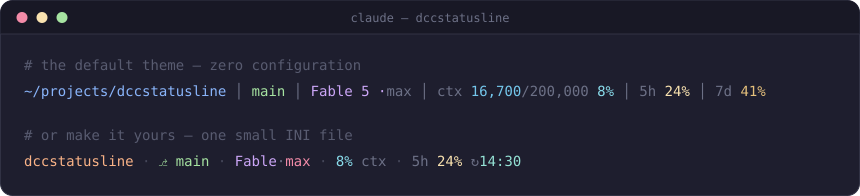

<div align="center">

# dccstatusline

**Doc's Claude Code Status Line — pure C, zero dependencies, ~250 microseconds.**

[](LICENSE)




</div>

Claude Code redraws its status line on every conversation beat — debounced to
300 ms, killing any refresh that dawdles. Most status lines answer with a shell
script that forks `jq`, forks `git`, and hopes. **dccstatusline answers with a
43 KB C binary that is done in about a quarter of a millisecond**: one read,
zero forks, zero heap allocations, one write, exit 0.

## What you get

- 🗂️ **cwd** — full, `~`-abbreviated, basename, one-letter-shrunk, or relative to the
  git repository root, and width-bounded by trailing-component depth or a hard
  column budget, so a deep work tree never eats half the line
- 🌿 **git branch** — read straight from `.git/HEAD` (worktrees and submodules
  included), never by spawning `git`; detached HEAD shows the short SHA
- 🤖 **model** — name, version derived from the model id, and effort level
  (`Fable 5 ·max`)
- 🧠 **context** — tokens used, ceiling, and percentage, with digit grouping
- ⏳ **plan usage** — both rate-limit windows (5-hour and 7-day today),
  counting down to the reset (`↻04:12`) or showing its local time in 24- or
  12-hour form; the sections are window-agnostic, so if the windows ever
  change, your config doesn't
- 🎨 **per-element color** — every token of every section takes its own
  foreground and background: 16 ANSI names, 256-palette numbers, or `#rrggbb`
- 🧩 **format templates** — reorder and repunctuate each section freely;
  a token with nothing to show swallows the punctuation before it, so
  `{name} {ver} ·{effort}` degrades to `Fable 5`, never to `Fable 5 ·`
- 🪶 **works with no config at all** — the defaults are the screenshot above

## Measured, not promised

| metric | value |
|---|---|
| full refresh cycle — spawn, parse, render, exit | **~250 µs** |
| syscalls per refresh | **49** |
| heap allocations | **0** |
| stripped release binary | **43 KB** |
| libFuzzer executions through the full render path, ASan+UBSan, findings | **3.3 M, zero** |

<sub>2000-run average including process spawn, release build (`-O2`, LTO),
AMD Ryzen 9 9950X, Linux. Your numbers will vary; the order of magnitude
won't.</sub>

A failed refresh can never blank your status line: on malformed, truncated, or
hostile input the binary still prints a fallback line and still exits 0 — a
guarantee enforced by construction (single exit path) and hammered by fuzzing.

## Quick start

No toolchain? Grab a static musl binary (x86_64 or aarch64, no dependencies at
all) — the `latest` URL is stable across releases:

```sh
curl -sL -o ~/.local/bin/dccstatusline \
  https://github.com/gshearer/dccstatusline/releases/latest/download/dccstatusline-$(uname -m)-linux-musl
chmod +x ~/.local/bin/dccstatusline
```

On macOS (Apple Silicon), grab the native binary — dynamically linked against
`libSystem`, since macOS has no static libc:

```sh
curl -sL -o ~/.local/bin/dccstatusline \
  https://github.com/gshearer/dccstatusline/releases/latest/download/dccstatusline-arm64-macos
chmod +x ~/.local/bin/dccstatusline
```

The binary is unsigned. `curl` does not quarantine what it downloads, so the
above just works; a *browser* download does, and Gatekeeper will then refuse to
run it until you clear the flag once:

```sh
xattr -d com.apple.quarantine ~/.local/bin/dccstatusline
```

Or build from source:

```sh
git clone https://github.com/gshearer/dccstatusline.git
cd dccstatusline
meson setup build-release -Doptimization=2 -Ddebug=false -Db_lto=true --prefix ~/.local
ninja -C build-release install
```

Then point Claude Code at it in `~/.claude/settings.json`:

```json
{
  "statusLine": {
    "type": "command",
    "command": "/home/you/.local/bin/dccstatusline",
    "padding": 0
  }
}
```

That's it — the defaults need no config file. Full build matrix (dev, ASan,
fuzzing) lives in [BUILD.md](BUILD.md).

## Configuration

One small INI file at `~/.config/dccstatusline/config` (XDG respected,
`DCCSTATUSLINE_CONFIG` overrides). Every key optional; parse errors keep that
key's default rather than breaking your line. The fully commented reference —
identical to the compiled-in defaults — is
[`examples/config`](examples/config).

```ini
[statusline]
sections  = cwd git model context plan_short plan_long
separator = " │ "

[git]
format    = "⎇ {branch}"
branch_fg = #a6e3a1          # truecolor needs no quoting

[context]
format  = {label} {used}/{ceiling} {pct}
label   = ctx
used_fg = cyan
pct_fg  = bright_cyan

[plan_long]
format = {window} {pct} ↻{resets}
resets = clock                     # "7d 41% ↻Mon 14:30"

[cwd]
style   = repo                     # …/acme/platform/terraform/app → platform/terraform/app
max_len = 28                       # and never wider than 28 columns
```

| section | tokens |
|---|---|
| `cwd` | `{path}` — plus `style = abbrev \| full \| basename \| shrink \| repo`, `depth = N`, `max_len = N` |
| `git` | `{branch}` |
| `model` | `{name}` `{ver}` `{effort}` `{id}` |
| `context` | `{used}` `{ceiling}` `{pct}` |
| `plan_short` / `plan_long` | `{window}` `{pct}` `{resets}` — plus `resets = countdown \| clock \| clock12` |

Every section also has `{label}`, filled from its `label =` key, and takes
`fg`/`bg` for its literal text plus `<token>_fg` / `<token>_bg` per token.

### Keeping the cwd short

A deep monorepo path — `/mnt/volumes/source/acme/platform/terraform/projects-modular`
and its like — is wider than the rest of the line put together. The `cwd`
section shortens in three independent stages — base form, then depth, then a
hard column budget — and whatever it elides becomes a single `…`:

| config | result |
|---|---|
| *(default)* `style = abbrev` | `/mnt/volumes/source/acme/platform/terraform/projects-modular` |
| `depth = 2` | `…/terraform/projects-modular` |
| `max_len = 30` | `…/terraform/projects-modular` |
| `style = shrink` | `/m/v/s/a/p/t/projects-modular` |
| `style = shrink` + `depth = 4` | `/m/v/s/acme/platform/terraform/projects-modular` |
| `style = repo` | `platform/terraform/projects-modular` |
| `style = repo` + `max_len = 24` | `…/projects-modular` |

- **`depth = N`** keeps the last N components whole. Under `style = shrink` those
  N stay spelled out and the rest collapse to a letter each; under every other
  style the rest simply go.
- **`max_len = N`** is a promise about width in columns: leading components give
  way first, and only a last component that still overflows alone gets cut.
  Columns are codepoints, and cuts land on codepoint boundaries, so `pröjekt`
  is never sliced mid-character.
- **`style = repo`** is the one that keeps meaning per column: the path below the
  git root, the root's own directory name included, so you still see which
  project you are in. Outside a repository it falls back to `abbrev`.

## Under the hood

For the reader who enjoys knowing why it's fast:

- **No fork, ever.** The git branch comes from walking up to `.git` and
  reading `HEAD` by hand — one `open()` per directory level, worktree
  `gitdir:` files followed exactly one hop, sha256 repositories understood.
- **Zero-copy, zero-heap.** The JSON payload is parsed with a pull cursor
  over the stdin buffer; strings unescape *in place* (every rewrite shrinks,
  by proof), so rendered values are views, not copies. All buffers are fixed.
- **Hostile-input hardened.** The JSON skip path is iterative with a depth
  cap — no recursion for malicious nesting to smash — and unknown fields are
  skipped wholesale, so new Claude Code payload fields never break an old
  binary. Both external-input parsers are fuzzed through the entire render
  path under ASan/UBSan.
- **Truncation cannot tear.** The output writer saturates at capacity,
  refuses partial escape sequences, and reserves its final bytes so the
  closing SGR reset always lands — a torn line can never bleed color into
  your terminal.
- **Built strict.** `gnu23`, `-Wall -Wextra -Wpedantic -Werror`,
  `_FORTIFY_SOURCE=3`, stack protector and clash protection, LTO release,
  test suites green under AddressSanitizer and UndefinedBehaviorSanitizer.

## License

[MIT](LICENSE) © 2026 George Shearer

**Designed by** George Shearer (george at shearer dot tech) ·
**Written by** [Claude](https://claude.com/claude-code)
